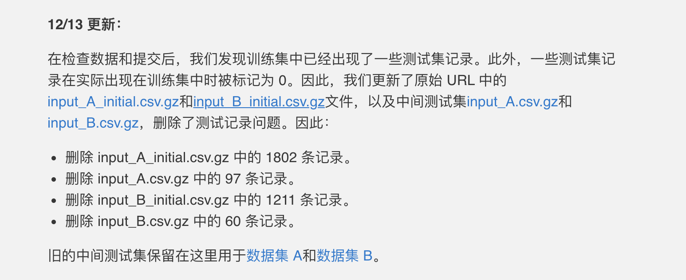

# WSDM_DGL_Challenge
[[WSDM Cup 2022: Temporal Link Prediction Task](https://www.dgl.ai/WSDM2022-Challenge/)] | [Team: MegaTron]

<!-- # WSDM 2022 Large-scale Temporal Graph Link Prediction - Baseline and Initial Test Set -->

[[WSDM Cup Website link](https://www.wsdm-conference.org/2022/call-for-wsdm-cup-proposals/)] | [[Link to this challenge](https://www.dgl.ai/WSDM2022-Challenge/)]

<!-- This branch offers

* An initial test set having 10,000 test examples for each dataset, together with their labels in `exist` column.  Note that this test set only serves for development purposes.  So
  * The intermediate and final dataset will **not** contain the `exist` column.
  * This is **not** the intermediate dataset we will be using for ranking solutions.
* A simple baseline that trains on both datasets.

Download links to initial test set: [Dataset A](https://data.dgl.ai/dataset/WSDMCup2022/input_A_initial.csv.gz) [Dataset B](https://data.dgl.ai/dataset/WSDMCup2022/input_B_initial.csv.gz) -->

## Environment
```bash
dgl-cu102==0.7.2
pytorch==1.7.0
sklearn
pandas
numpy
tqdm
...
```
## GPU
+ Tesla V100 (32GB) * 1

## Usage

不需要手动下载数据集，直接运行程序即可。

<!-- To use the baseline you need to install [DGL](https://www.dgl.ai).

~~ou also need at least 64GB of CPU memory.  GPU is not required.~~ -->

**mini-batch train in GPU, full batch inference in CPU.**

1. Convert csv file to DGL graph objects.

   ```bash
   python3 csv2DGLgraph.py --dataset A
   python3 csv2DGLgraph.py --dataset B
   ```

2. Training.

   ```bash
   cd scripts/
   bash trainA.sh 
   bash trainB.sh 
   ```
3. Result.
   ```bash
   # middle test
   cd outputs/middle/
   zip output_middle.zip output_A.csv output_B.csv
   # final test
   cd outputs/
   zip output_final.zip output_A.csv output_B.csv
   ```

<!-- #### Args
```bash
usage: Base [-h] [--dataset {A,B}] [--train_path TRAIN_PATH]
            [--test_path TEST_PATH] [--graph_path GRAPH_PATH]
            [--output_path OUTPUT_PATH] [--lr LR] [--epochs EPOCHS]
            [--node_enc_dim NODE_ENC_DIM] [--hid_dim HID_DIM]
            [--emb_dim EMB_DIM] [--time_dim TIME_DIM] [--n_layers N_LAYERS]
            [--weight_decay WEIGHT_DECAY] [--gpu GPU] [--seed SEED]
            [--batch_size BATCH_SIZE] [--num_heads NUM_HEADS]

optional arguments:
  -h, --help            show this help message and exit
  --dataset {A,B}       Dataset name
  --train_path TRAIN_PATH
                        train data path
  --test_path TEST_PATH
                        test data path
  --graph_path GRAPH_PATH
                        dgl graph path
  --output_path OUTPUT_PATH
                        output path
  --lr LR               learning rate
  --epochs EPOCHS       Number of epochs
  --node_enc_dim NODE_ENC_DIM
                        embedding dim of node feature in A
  --hid_dim HID_DIM     number of hidden gnn units
  --emb_dim EMB_DIM     number of final gnn embedding units
  --time_dim TIME_DIM   number of time encoding dims
  --n_layers N_LAYERS   number of hidden gnn layers
  --weight_decay WEIGHT_DECAY
                        Weight for L2 loss
  --gpu GPU             number of GPU
  --seed SEED           number of seed
  --batch_size BATCH_SIZE
                        batch size
  --num_heads NUM_HEADS
                        number of heads
``` -->

## Result


| Date | Method | middle test AUC of **A** | middle test AUC of **B** |
|:-:|:-:|:-:|:-:|
| 2022.01.15 | R-GAT (最终提交版本) | 0.494439 | 0.501796 |
| 2021.12.16 | R-GAT (中期提交版本) | 0.498004853 | 0.505898455 |
感觉是在middle test上过拟合了。。就随便交一个吧。。


<!--  -->

<!-- 由于12.13测试集发生改变，所以重新跑了一下。 -->

| Date | Method | **Best** initial test AUC of **A** | **Best** initial test AUC of **B** |
|:-:|:-:|:-:|:-:|
| 2022.01.15 | R-GAT (最终提交版本) | 0.6428 | 0.61544 |
| 2021.12.16 | R-GAT (中期提交版本) | 0.6357 | 0.61544 |
| 2021.12.08 | R-GAT | 0.62721 | 0.60426 |
| 2021.12.03 | minibatch  | 0.6113 | 0.58478 |
| 2021.11.31 | new time encoding  | 0.57364 | 0.57479 |
| 2021.11.29 | 数据预处理 | 0.52814 | 0.53116 |
| ----       | raw baseline | 0.511 | 0.510 |

<!-- | 2021.12.14 | R-GAT (中期提交版本) | 0.63458 | 0.61346 | -->


---
## 一些探索和记录（可忽略）
#### 一些问题
参数敏感，只在initial上拟合，未必在最终的test上拟合。B不同的run，结果稍有不同。

#### 关于 initial test 和 middle test 的数据分布问题
分布是否一致关系到initial test上的参考价值，因此 `explore.ipynb` 探索了每个query的etype, timestamp, src, dst
+ A: initial (9999 querys) 和 middle (50000 querys) 的数据分布基本一致
+ B: initial (5704 querys) 和 middle (50000 querys) 的数据分布在etype上, timestamp基本一致，src 和 dst有一些差异，不过src 和 dst的分布比较平均（点的个数没有特别多的）

#### 训练集的数据缺失问题
+ A: node_feat 缺失占比为 **76%** ！
+ B: edge_feat 缺失占比为 **57%** !

#### 数据预处理
Time encoding：
+ A: 时间戳为10位十进制数，抽出每一位分别进行`nn.Embedding`的映射，然后从左到右进行concat得到`time_emb`。
+ B: 时间戳为10位十进制数，从左到右优先级依次降低，每列重复10-i次，然后从左到右进行concat得到`time_emb`。
+ 均舍弃了原始时间戳的第一位`1`（2021年才是16开头的数）。

A:
+ node_feat所有缺失值用max+1（417）来填充，包括csv的整行确实
+ train: ndata['feat']8列分别进行encoding，得到可学习的embedding后，stack+sum
+ g.edata['feat']进行手动广播，和边进行一一对应
+ ~~def emb_conccat() --> cat(src['emb'], edge_feat_emb, dst['emb])~~

B: 
+ g.edata['feat']缺失值进行0填充
+ g.ndata['feat']聚合异构图中邻边的edata['feat']


#### 异构图的构造

A:
+ edge: `{('Node', 'e_type', 'Node'): (src, dst)}`
+ edata['ts']: `{('Node', 'e_type', 'Node'): (time)}`
+ ndata['feat']: `{'Node': 部分节点有特征，部分节点没有特征为全0}`
+ etype_feat: 目前没用到，边类型的特征

B: 
+ edge: `{('User', 'e_type', 'Item'): (src, dst)}`
+ edata['ts']: `{('User', 'e_type', 'Item'): (time)}` 
+ edata['feat']: `{('User', 'e_type', 'Item'): 单纯的边特征}`
+ etype_feat: None

```bash
# etype = ('User', '1', 'Item')
>>> g.edata['ts'][('User', '1', 'Item')].shape
torch.Size([29457])
>>> g.edata['feat'][('User', '1', 'Item')].shape
torch.Size([29457, 768])
>>> g.edges[('User', '1', 'Item')].data['feat'].shape
torch.Size([29457, 768])
```

#### 异构图GNN

每种类型的边分别定义GNN算子：
```bash
{
   ('User', '1', 'Item'): dgl.nn.SAGEConv(...),
   ...
   ('User', '1_reversed', 'Item'): dgl.nn.SAGEConv(...),
}
```


#### ~~时间编码 (time encoding)：~~
~~时间戳为10位十进制数，抽出每一位乘0.1组成一个10维向量。~~

~~例如，时间戳为`1420079360`, encoding后变成10维向量为 `[0.1, 0.4, 0.2, 0.0, 0.0, 0.7, 0.9, 0.3, 0.6, 0.0]`~~

#### 负采样时间戳（random index）--> `t'`
+ `t <= t', label = 1`
+ `t >  t', label = 0`

求解 `P(t <= t' | s, d, r)`，表示在时间`t'`**之前**，从源节点s到目标节点d之前存在r类型的边的概率。最终inference：`t_start ~ t_end` 之间，从源节点s到目标节点d之前存在r类型的边的概率。

**`P(t_start <= t <= t_end | s, d, r) = P(t <= t_end | s, d, r) - P(t <= t_start | s, d, r)`**

#### 训练流程
1. 根据 heterogeneous graph 结构和 ndata['feat']，通过 HGNN 训练得到节点的 `node_emb`
2. 对于每条边，`edge_emb = cat([src_node_emb, dst_node_emb])` 
3. 正/负采样，得到正样本和负样本的 `timestamp` 和 `label`
4. time encoding 得到 `time_emb`
5. 对于每条边，`cat([edge_emb, time_emb])` 之后，过Linear层得到出现的概率 `probs`
6. BCEWithLogitsLoss() + backward()更新参数

#### 一些细节
baseline中，A没有使用 etype_feat，B没有使用 edata['feat']

<!-- ---

The baseline is only a minimal working example for both datasets, and it is certainly not optimal.  **You are encouraged to tweak it or propose your own solutions from scratch!**

Here we summarize our baseline:
The baseline is an [RGCN](https://arxiv.org/abs/1703.06103)-like GNN model trained on the entire graph.
Event timestamps on the graph are encoded by decomposing the 10-digit decimal integers into 10-dimensional vectors, each element representing a digit.
We train the model as binary classification using a negative-sampling-like strategy.
Given a ground truth event `(s, d, r, t)` with source node `s`, destination node `d`, event type `r` and timestamp `t`, we perturb `t` to obtain a new value `t'`.
We label the quadruplet with 1 if the new timestamp is larger than the original timestamp, and 0 otherwise.  The model is essentially trained to
predict `p(t < t' | s, d, r)`, i.e. the probability that an edge with type `r` exists from source `s` and destination `d` before timestamp `t'`. -->


<!-- ## Performance on Initial Test Set

The baseline got AUC of 0.511 on Dataset A and 0.510 on Dataset B. -->

## Tree
```bash
.
├── csv2DGLgraph.py
├── DGLgraphs
│   ├── Dataset_A.bin
│   └── Dataset_B.bin
├── explore.ipynb
├── LICENSE
├── main.py
├── model.py
├── outputs
│   ├── a.log
│   ├── best_auc_A.pkl
│   ├── best_auc_B.pkl
│   ├── b.log
│   ├── output_A.csv
│   ├── output_B.csv
│   └── output.zip
├── __pycache__
│   └── model.cpython-37.pyc
├── README 2.md
├── README.md
├── scripts
│   ├── result.sh
│   ├── trainA.sh
│   └── trainB.sh
├── test_csvs
│   ├── input_A.csv
│   ├── input_A_initial.csv
│   ├── input_B.csv
│   └── input_B_initial.csv
└── train_csvs
    ├── edges_train_A.csv
    ├── edges_train_B.csv
    ├── edge_type_features.csv
    └── node_features.csv

6 directories, 28 files
```